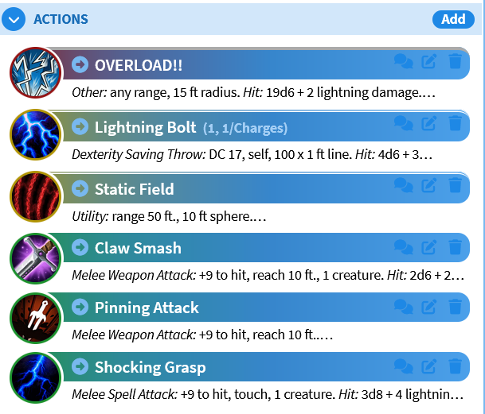
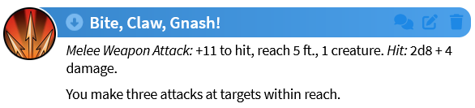

# Changelog

## v1.1.2.3 (latest)

* #69 Fixed a deprecation (an old one!) that was sneaking by and finally broke in dnd5e 3.3.1. It was preventing damage from being added or removed from scaling abilities.
* Fixed bug in damage rolling in certain circumstances (from dev c29c7b2)

## v1.1.2.2

* Confirmed dnd5e 3.3.0 compatibility
* #59 Fixed descriptions on items to use the new editor and updated save/load code for same
* #62 Fixed some bugs around damage rolling by updating to the newer rollConfigs format
* Fixed bug with shortcoders 
* Fix with max attribute breaking TST count

## v1.1.1.3

* #57 Bugfix for enter adding effects to abilities and monsters when editing fields

## v1.1.1.2

* Foundry v12 support (tentative)
* dnd5e 3.2 support (tentative)
	* Dice formula error checking fix
	* Weight conversions
* #56 Maximum dice now works for shortcoded damage

## v1.1.0.7

* Added MidiQOL and DFred's Convenient Effects as 'recommended' modules. They're not required for GMMC to function, but GMMC has content for them if you are using them.
* Put the compendium folders in a "Giffyglyph's Monster Maker" top level folder for easier sorting. It's green!
* #19 V12 compatibility updates for the RC and dnd5e 3.1. **V12 IS A BETA!** You shouldn't use it for in-progress games even when it reaches "stable" soon. Please do report issues you find, just be aware that some functionality may take time to fix! Additionally, whenever dnd5e 3.2 comes out that will likely break things too.

* #34 Added support for ability rarity. This is selected under the "Action Type" accordian on the action editor. 
	* Abilities will display color and border tags for their rarity, as well as listing it on the editor.
	* Updated rarities for all items in the compendiums that have rarities.
	* This change is mainly visual and for tracking abilities as a GM, it doesn't restrict anything about ability creation.

* #43 Added a new compendium for Conditions. (pdf 75)
	* Simply drag and drop conditions from the actor in the compendium as necessary
	* Where possible, these have active effects as well (Some may require MidiQOL or DAE).
* #43 (continued) Included an importable json for DFred's convenient effects that adds all of the conditions as custom CE's.
	* That file can be found in the 'importables' directory of the module's folder.

* #48 Added *deferrals* to features. (pdf 43)
	* They have a new dropdown in the feature editor window where you can set the type of deferral (dooming or delayed), their timer, and a respite/dispel condition.
	* There is no automation associated with these at the moment. Roadmap item?

* #50 Added an effects tab for Monsters and Features
	* You can now view and create effects similar to the 'effects' tab in the default sheets.
	* It's in the 'effects' dropdown in the blueprints
	* Drop Active Effects onto sheets to add them to the monsters, or make your attacks apply conditions when they hit!

* #38 Reorganized the monster blueprint sidebar to improve logical organization and readability. I'm open to [suggestions](https://github.com/Skyl3lazer/giffyglyph-monster-maker-continued/issues/38) if you have opinions on what is where.
	* The vague idea now for the categories: Basic, Scaling Abilities, General Features, Overrides, Flavor, "Loot", Display
* Fixed an issue if you converted a monster with no creature type.
* #47 Compendium fixes (typos, settings, etc)
* #42 Fixed the "add" button for inventory items not working
* #42 (cont) If "always show" is enabled for either encumbrance or currency, the inventory will show.
* #41 Added overkill attacks, and a mix of delayed/mixed effect attacks to the attacks compendium.

## v1.0.2.1

* Fixed non-save traits throwing console error
* Fixed Activation Condition sometimes preventing a monster load
* Fixed Powerful Build (inventory) not doing anything
* #36 Fixed interactions between actions and encumbrance variants
* #44 Fixed checking for wrong updated thing (foundry rather than dnd5e) for a backwards compatibility issue

## v1.0.1.2

1.0 is here! In addition to a number of bugfixes and compatibility updates, 1.0 features a few big ticket items:

* GMMv3 Compendium Updates! You can now add Traits, Features, and Attacks directly from the v3 PDF!
	* This means that the compendiums are now in the new format, rather than the old ".db" files that get converted and take time to load.
	* These new compendiums have built in scalars, attacks, etc, that all work right out of the box and look great.
	* The old items are still available in the !V2 folders within compendiums if you want to use them.
	* Hardlinks to compendium items will break! This is a one time unavoidable change, and had to happen either now or later (when you had links to new items).
	* In the future I'd like to add DAE and others as optional dependencies and add DAE/automation to the compendiums!

* In service of the new compendiums, there are a number of new QOL features when building your own scalar abilities, such as
	* Finally being able to see the range/etc on attacks that don't roll to-hit or have a save (utility, healing, other, etc)
	* New shortcodes! [name] and [maxMod] can be used anywhere.
	* You can select "Highest Ability" for the Related Ability dropdown in the Attack menu to make your scalar ability automatically use whatever highest stat your monsters have.
	* Monster abilities can now require concentration.

* NOTE ON FOUNDRY V10 SUPPORT:
 	* **V10 SUPPORT WILL END NO LATER THAN V14. IT MAY END IN V13, DEPENDING ON CHANGES.**
	* I have tried to maintain support for v10 in the 1.0 launch, and have been *mostly* successful. There are a few caveats
	* Concentration will only work on spells.
	* The new Traits compendium will not be available, and the Features/Attacks compendium won't be getting the updates.
		* This is because the format of the compendiums has changed and is not backwards compatible, and creating new compendiums ONLY for V10 (and being unable to use folders) isn't feasable for me.
		* If you want to create new v10 compendiums and pull request them I'm happy to look
	* For now it looks like I can keep V10 support in V12.
	* As support is still active for V10, please submit any bugs you find, even if they are V10 specific!
	* Whenever V10 support does end, I'll create a V10 branch you can continue to use (similar to the current MMv2 branch).
	* I highly recommend you upgrade to V11.

Full changelog:

* v12 Foundry Deprecation Fixes (v12 not supported currently on this branch)
* #20 dnd5e 3.1 compatability
* #18 Fixes to swarm size
* #21 Fixes for hit points, including max hp issues on 3.0
* #22 Added the [name] shortcode
* #23 Fixed display of formula rolled hp
* #24 Fixed using ammo items on scaling abilities, and cleaned up chat messages when you do so [mainly a legacy feature]
* Fixed spell save DC calculations (for actual spells you give monsters)
* Fixed components and VSM info for spells
* Fixed loot item value showing on sheet, and added units
* #28 Added a "Highest Stat" option to the "Related Ability" dropdown in Attack Option, which lets a scalar ability always scale off of the Highest Stat
* #27 Added a related shortcode [maxMod]
* #32 Added hinter text to anything with an attack if it has a to-hit, range, area, or save DC. 
	* I.E. You can now add a range+area to a utility attack and have it show.
* #29 Added a GMMv3 "Traits" compendium
	* This is a first take on this compendium. If you find an issue, please report it.
* #30 Updated the "Powers" compendium to GMMv3
	* This is a large update to this compendium. If you find an issue, please report it.
* #31 Updated the "Attacks" compendium to GMMv3
	* Should now have the balance numbers from the V3 PDF, and naming scheme changed to match (even if many are functionally the same as V2)
	* This is a large update to this compendium. If you find an issue, please report it.
	* More examples will be added in the future.
* #33 Added ability for Scalar Abilities to require Concentration
	* This also sets me up to be able to support other "Properties" (magical, etc) on Scalars in the future.
* Added description pills to show duration, concentration, and activation requirement (for now)
* Added a few v10 compatibility tweaks
* Renamed the folder/dbs for the compendiums to be consistent with their name. 
	* This will break existing hardlinks to compendium items, but is necessary at some point in the future anyway.

## v0.12.0.2 (latest)

* Shortcoder warning supression for roll commands
* Fixes for paragon defense modifications and display

## v0.11.0.3

* Fixed an issue with async data loading on monster sheets, bringing back foldout descriptions on items! [#16](https://github.com/Skyl3lazer/giffyglyph-monster-maker-continued/issues/16)

## v0.11.0.2

* Made the shortcoder work on item descriptions and chat output.
* Made the 'chat' button on item cards display a description card instead of rolling the item. Thanks to @thatlonelybugbear from the Midi discord!
* Monster items added to a master sheet will properly become the correct type.

## v0.10.0.3

* Fix to module manifest for dnd5e version compatability

## v0.10

* Testing/confirming v11 compatability

## v0.9.3

* Fixed a small libwrapper issue that affected non-gmm item usage for some automations.

## v0.9

* Fixed ability_bonus on rank not affecting creatures
* Fixed some issue with libwrapper hooks doing unintended things to non GMM monsters (specifically item rolls)
* Updated pack deprecations. Note they still aren't all v3 abilities.
* Added missing strings
* Fixed paragon defenses reporting as action amount

## v0.8

* Added a shortcoder to CONFIG.Item.documentClass.prototype.use to make the damage on the item get shortcoded in at use-time
  * This should make shortcodes integrate better to other mods like RSR
* Fix for non-gmm shortcodes in descriptions breaking
* Updated some missing strings

## v0.7

* Fixed an issue with save DCs being null
* Added libwrapper as a dependency, and implemented it to cover anything that we wrapped already
* Updated processing for the following items to be affected by DAE and display correctly
  *  AC, Skills (proficiency and check bonuses), Passive Perception, Saving Throws, Initiative (doesn't display right)

## v0.6

* Fixed damage types
* Fixed occasional error with blank form fields causing errors

## v0.5

* Fixed damage, misses, and versatile damage

## v0.4

* Updating to GMM v3

## v0.3

* Updated to Foundry v10, dnd5e 2.1+, GMM v2
